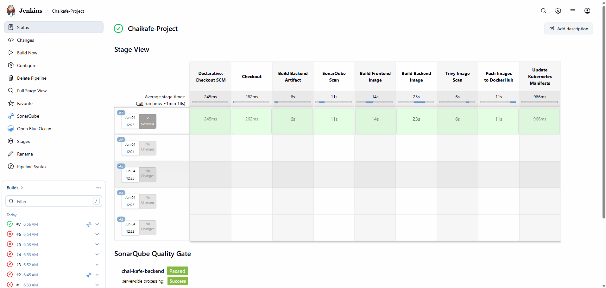
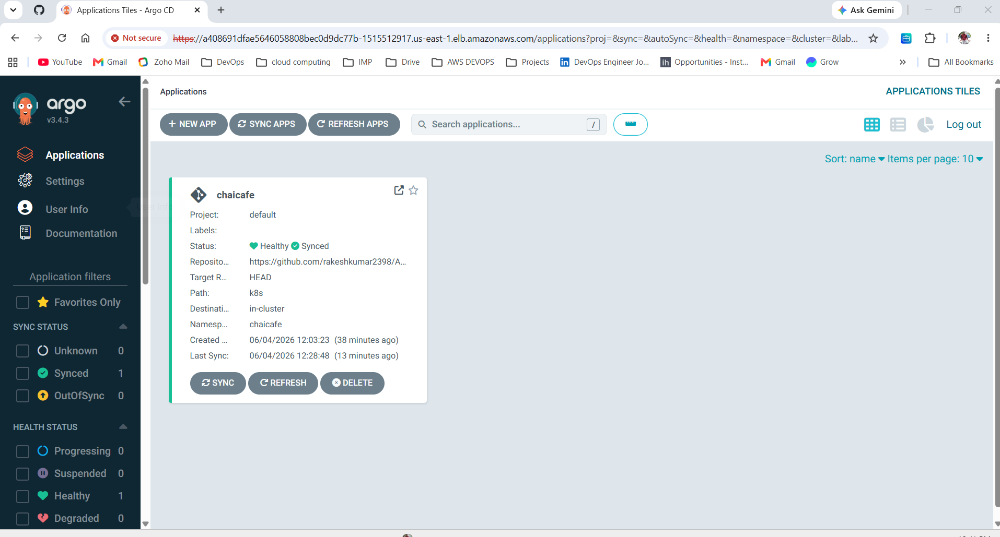
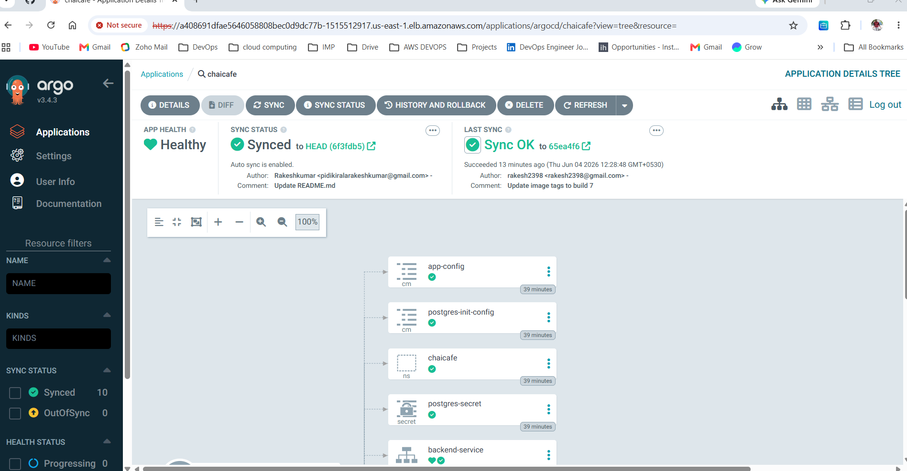
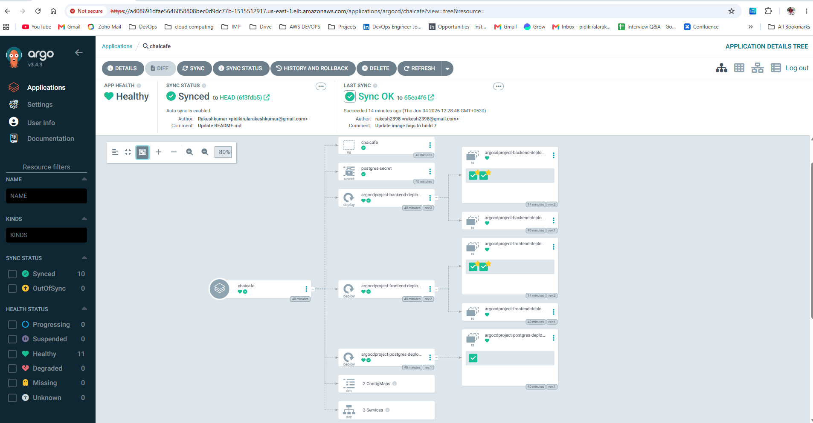
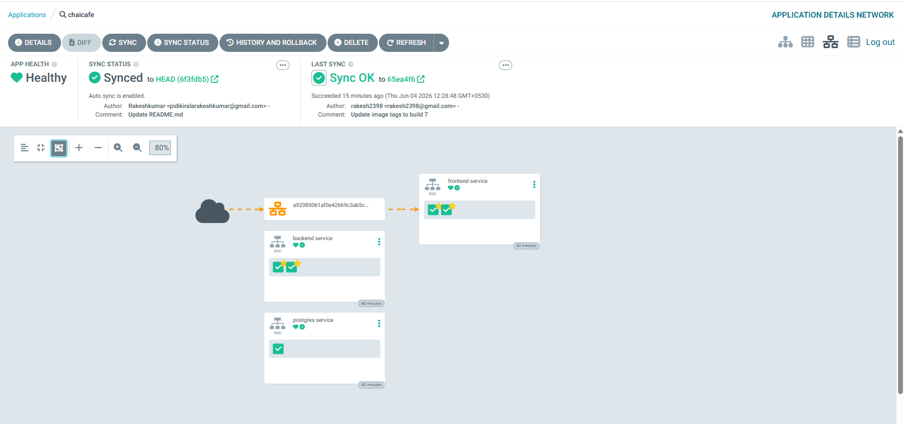
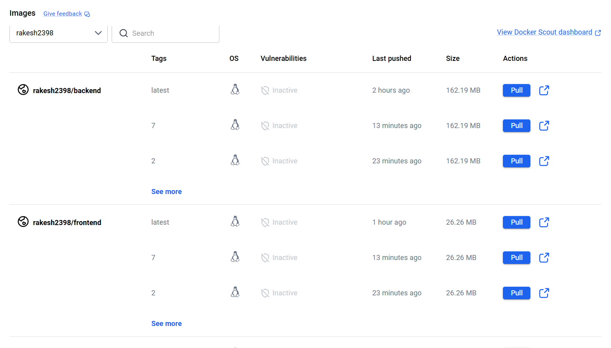
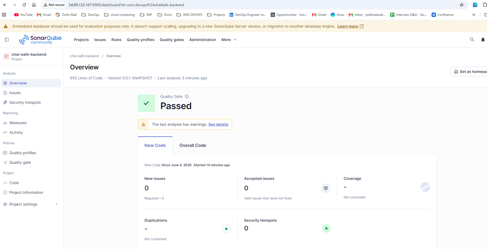
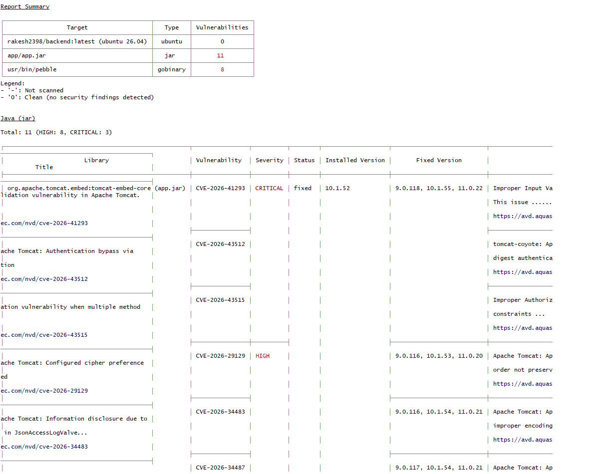
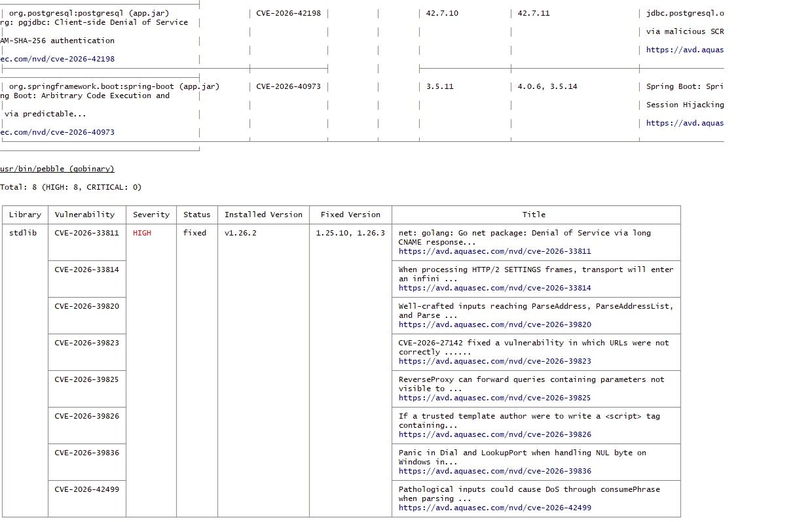
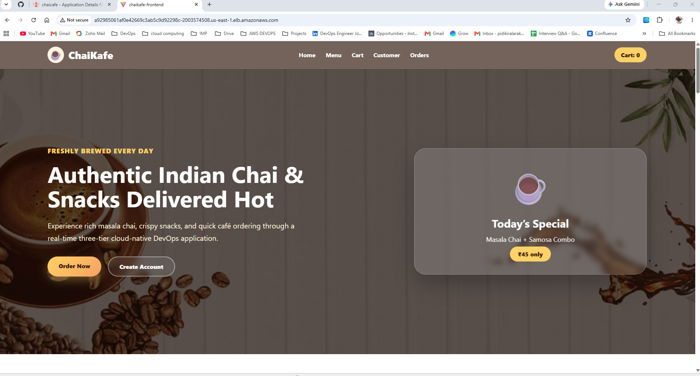

# ☕ ChaiCafe – Three Tier GitOps DevOps Project(ArgoCD)

## 🚀 Project Overview

ChaiCafe is a full-stack three-tier cloud-native application deployed on AWS EKS using Kubernetes and GitOps practices.

This project demonstrates complete CI/CD automation using Jenkins, Docker, SonarQube, Trivy, DockerHub, ArgoCD, PostgreSQL, and Amazon EKS.

---

## Project Type

This is a DevOps portfolio project created to demonstrate practical hands-on experience with Kubernetes, AWS EKS, CI/CD, GitOps, container security scanning, and application deployment.

This project is not a production system, but it follows real-world DevOps deployment practices.

---

# 🏗️ Architecture

```text
Developer → GitHub → Jenkins Pipeline
                    ↓
        Build + Scan + Docker Push
                    ↓
        Update Kubernetes Manifests
                    ↓
                GitHub Repo
                    ↓
                 ArgoCD
                    ↓
             Amazon EKS Cluster
                    ↓
    Frontend ↔ Backend ↔ PostgreSQL
```

---

# ⚙️ Tech Stack

## ☁️ Cloud & Containerization

- AWS EKS
- Docker
- DockerHub
- Kubernetes

## 🔄 CI/CD & GitOps

- Jenkins
- ArgoCD
- GitHub

## 🔐 Security & Quality

- SonarQube
- Trivy

## ⚙️ Backend

- Spring Boot
- Maven
- PostgreSQL

## 🎨 Frontend

- React
- Nginx

---

# 📂 Kubernetes Resources Used

- Namespace
- Deployments
- Services
- ConfigMaps
- Secrets
- LoadBalancer
- ReplicaSets

---

# 🔥 Features Implemented

✅ Three-tier architecture deployment on AWS EKS  
✅ Kubernetes Deployments and Services  
✅ ConfigMaps and Secrets integration  
✅ PostgreSQL database initialization using init.sql  
✅ Frontend ↔ Backend communication using Kubernetes DNS  
✅ Docker image build and push using Jenkins  
✅ SonarQube static code analysis  
✅ Trivy image vulnerability scanning  
✅ GitOps workflow using ArgoCD  
✅ Automatic deployment sync from GitHub to EKS  
✅ Rolling updates using Kubernetes Deployments  

---

# 📌 CI/CD Workflow

1. Developer pushes code to GitHub  
2. Jenkins pipeline triggers automatically  
3. Backend artifact gets built using Maven  
4. SonarQube performs code quality scan  
5. Docker images are built  
6. Trivy scans images for vulnerabilities  
7. Docker images pushed to DockerHub  
8. Jenkins updates Kubernetes manifest image tags  
9. Updated manifests pushed to GitHub  
10. ArgoCD detects Git changes  
11. ArgoCD syncs changes to AWS EKS automatically  

---

# ☁️ AWS Infrastructure

- Amazon EKS Cluster
- EC2 Worker Nodes
- Application Load Balancer
- Security Groups
- IAM Roles
- VPC Networking

---

# 🧠 Key Learnings

- Kubernetes troubleshooting
- CrashLoopBackOff debugging
- ImagePullBackOff resolution
- Kubernetes DNS and Service discovery
- ConfigMaps & Secrets management
- GitOps implementation using ArgoCD
- End-to-end CI/CD pipeline automation
- PostgreSQL initialization in Kubernetes
- Production-style troubleshooting and deployment workflow

---

## 📸 Project Screenshots

### 🔄 Jenkins CI/CD Pipeline


---

### ☁️ Amazon EKS Kubernetes Resources


---

### 🚀 ArgoCD GitOps Dashboard


### 🚀 ArgoCD Application Resources


### 🚀 ArgoCD Deployment View


### 🚀 ArgoCD Sync Status


---

### 🐳 DockerHub Images


---

### 🔐 SonarQube Code Quality Dashboard


---

### 🛡️ Trivy Vulnerability Scan


### 🛡️ Trivy Critical Scan


---

### ☕ ChaiCafe Frontend Application


---

# 👨‍💻 Author

Rakesh Kumar  
DevOps & Cloud Engineer
